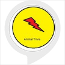

# &nbsp; [animal trivia](http://alexa.amazon.com/#skills/amzn1.ask.skill.9c657753-8a94-4fc2-a218-cfc71d81a162)
 0

To use the animal trivia skill, try saying...

* *Alexa ask animal trivia a fact*

* *Alexa ask animal trivia to tell me an animal fact*

* *Alexa ask animal trivia to tell me something*

A good skill to entertain & educate children with animal fun facts.

***

### Skill Details

* **Invocation Name:** animal trivia
* **Category:** null
* **ID:** amzn1.ask.skill.9c657753-8a94-4fc2-a218-cfc71d81a162
* **ASIN:** B01JDRBD9W
* **Author:** Samkit Jain
* **Release Date:** August 8, 2016 @ 02:37:54
* **In-App Purchasing:** No
