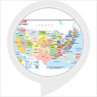

# &nbsp; [State Capitals  Flash Cards](http://alexa.amazon.com/#skills/amzn1.ask.skill.34400ea0-0027-436e-9859-84ce324c2dd4)
 0

To use the State Capitals  Flash Cards skill, try saying...

* *Alexa ask State Capitals*

* *Alexa start State Capitals*

* *Alexa open State Capitals*

Tests you on your knowledge of US State capitals for all 50 states including District of Columbia. Will ask you to provide the state capitals for 5 states which are randomly chosen and then your score is provided. There are not any prerequisites required.

***

### Skill Details

* **Invocation Name:** state capitals
* **Category:** null
* **ID:** amzn1.ask.skill.34400ea0-0027-436e-9859-84ce324c2dd4
* **ASIN:** B01JE55V1O
* **Author:** Travelers
* **Release Date:** August 12, 2016 @ 09:37:22
* **In-App Purchasing:** No
