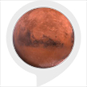

# &nbsp; [Life on Mars Facts](http://alexa.amazon.com/#skills/amzn1.ask.skill.eaa17ddd-d17e-4e79-8496-18e669566899)
 1

To use the Life on Mars Facts skill, try saying...

* *Alexa, ask life on mars to give me something about life on Mars*

* *Alexa, ask life on mars for a mars fact*

* *Alexa, tell life on mars to give me some Mars information*

If you are thinking it's about time to move away to Mars after going through the 2016 US election options, you can ask Alexa to give you some facts about life on Mars and what you can expect when you get there. There are so many positive aspects to this.

***

### Skill Details

* **Invocation Name:** life on mars
* **Category:** null
* **ID:** amzn1.ask.skill.eaa17ddd-d17e-4e79-8496-18e669566899
* **ASIN:** B01JFDUDTA
* **Author:** deepthiRao
* **Release Date:** August 10, 2016 @ 02:08:12
* **In-App Purchasing:** No
