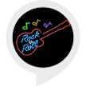

# &nbsp; [Rock Nerd](http://alexa.amazon.com/#skills/amzn1.ask.skill.5cc75c80-3453-47c4-ae2f-7cc7300c5c6c)
 0

To use the Rock Nerd skill, try saying...

* *Alexa, ask Rock Nerd to tell me a fact*

* *Alexa, tell Rock Nerd to give me trivia*

* *Alexa, start Rock Nerd*

This skill tells you a random rock and roll history fact.

***

### Skill Details

* **Invocation Name:** rock nerd
* **Category:** null
* **ID:** amzn1.ask.skill.5cc75c80-3453-47c4-ae2f-7cc7300c5c6c
* **ASIN:** B01JGS47LY
* **Author:** Digivine
* **Release Date:** August 3, 2016 @ 02:41:48
* **In-App Purchasing:** No
