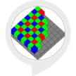

# &nbsp; [Technology Trivia](http://alexa.amazon.com/#skills/amzn1.ask.skill.7374cece-cb25-48a2-a05a-dc5a9d476458)
 0

To use the Technology Trivia skill, try saying...

* *Alexa, open Tech Trivia*

* *New game*

* *Skip*

You will be asked multiple-choice questions about cutting edge technology and be given a series of possible answers. Try your best to answer them correctly - the skill will keep a running score!

Enjoy learning technology trivia that you may not have known before!

***

### Skill Details

* **Invocation Name:** tech trivia
* **Category:** null
* **ID:** amzn1.ask.skill.7374cece-cb25-48a2-a05a-dc5a9d476458
* **ASIN:** B01JHHJKNO
* **Author:** Sabrina Knott's Masie Center Project
* **Release Date:** August 5, 2016 @ 04:37:53
* **In-App Purchasing:** No
