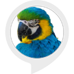

# &nbsp; [The annoying parrot](http://alexa.amazon.com/#skills/amzn1.echo-sdk-ams.app.d373f712-0b9f-4685-b9ac-e7e5cb11e54c)
 1

To use the The annoying parrot skill, try saying...

* *Alexa, start the annoying parrot*

* *What is your name*

* *Stop repeating me*

Start the app by saying, "Alexa, start the annoying parrot".
The parrot will greet you and let you know it will repeat what you say.
Then when you say something, it will (annoyingly ?:) ) repeat.

***

### Skill Details

* **Invocation Name:** the annoying parrot
* **Category:** null
* **ID:** amzn1.echo-sdk-ams.app.d373f712-0b9f-4685-b9ac-e7e5cb11e54c
* **ASIN:** B01JTK5JRK
* **Author:** Rajendra
* **Release Date:** August 13, 2016 @ 04:07:44
* **In-App Purchasing:** No
