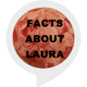

# &nbsp; [Facts About Laura](http://alexa.amazon.com/#skills/amzn1.ask.skill.bbd3cc9d-206d-44d9-9b81-15c7e55d46dc)
 0

To use the Facts About Laura skill, try saying...

* *Alexa, open Laura facts*

Curious about Laura? Here are some fun facts about Laura for you to enjoy.

***

### Skill Details

* **Invocation Name:** laura facts
* **Category:** null
* **ID:** amzn1.ask.skill.bbd3cc9d-206d-44d9-9b81-15c7e55d46dc
* **ASIN:** B01JU3T2II
* **Author:** PollySentrick
* **Release Date:** August 10, 2016 @ 02:37:47
* **In-App Purchasing:** No
