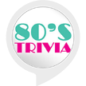

# &nbsp; [80s Trivia](http://alexa.amazon.com/#skills/amzn1.ask.skill.67ed1d74-04f9-4be0-bc17-636f8bcb32e7)
 0

To use the 80s Trivia skill, try saying...

* *Alexa, start eighties trivia*

* *Alexa, ask eighties trivia to start game*

* *Alexa, ask eighties trivia to start*

Five trivia questions from the 80s

***

### Skill Details

* **Invocation Name:** eighties trivia
* **Category:** null
* **ID:** amzn1.ask.skill.67ed1d74-04f9-4be0-bc17-636f8bcb32e7
* **ASIN:** B01JVOUQJA
* **Author:** Creative Arts and Technology
* **Release Date:** August 11, 2016 @ 01:37:38
* **Privacy Policy:** http://ledpixelart.com/privacy-policy/
* **Terms of Use:** http://ledpixelart.com/terms-of-use/
* **In-App Purchasing:** No
