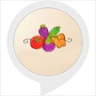

# &nbsp; [Food Facts](http://alexa.amazon.com/#skills/amzn1.ask.skill.aaac01ca-1ba7-463c-b696-d7f7c28fbf98)
 0

To use the Food Facts skill, try saying...

* *Alexa, ask food buddy a fact*

* *Alexa, ask food buddy a food fact*

* *Alexa, ask food buddy to tell me a fact*

This is a great skill to learn some interesting and fun facts about Food.

***

### Skill Details

* **Invocation Name:** food buddy
* **Category:** null
* **ID:** amzn1.ask.skill.aaac01ca-1ba7-463c-b696-d7f7c28fbf98
* **ASIN:** B01JVY3XGS
* **Author:** ST
* **Release Date:** August 8, 2016 @ 06:07:23
* **In-App Purchasing:** No
