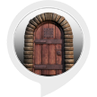

# &nbsp; [Dungeon Adventure](http://alexa.amazon.com/#skills/amzn1.echo-sdk-ams.app.83c405e9-0b21-45e7-a10e-5905632e5d24)
 6

To use the Dungeon Adventure skill, try saying...

* *Alexa, start dungeon adventure*

* *Alexa, open dungeon adventure*

* *Alexa, begin dungeon adventure*

Ravensburg needs your help, an evil necromancer and his monsters have been coming from the dungeon and attacking the town.  Your task is to slay the evil necromancer and return to town.  You will do this by equipping your brave adventurer and traveling to the dungeon to locate the evil necromancer.  In this dungeon crawling experience you will create a character and purchase items from the town such as weapons, armor, potions and spells but beware because the dungeon contains many different types of monsters and traps.  You will need to be well equipped and level up your character and then locate the evil necromancer who is somewhere in the dungeon and slay him to save the town. 
 
This is a complete fantasy role-playing game in which Alexa will become the dungeon master.  You will create a character, purchase items in the town, travel to the dungeon, fight monsters, level up your character, find chests, get more gold to go back to town and purchase better items.  First you will create a character and assign values to your character's attributes of strength, dexterity, intelligence, constitution, perception, charisma and wisdom.  The adventure will involve rolling dice to determine the outcomes of various tasks (Alexa will roll the dice for you).  Your character's attributes will affect how well your character does during the adventure giving you bonus modifiers that add or subtract from your rolls.  You will start in town where you can purchase various weapons, armors, potions and spells to help you during your adventure.  You will encounter various types of monsters in the dungeon that you can attack and kill which will give your character experience points that will be used to level up your character. 
 
It will be a difficult task to find the evil necromancer and slay him and return to town successfully but if you do it you will go down in the dungeon adventure hall of fame.  Below are some helpful tips for your dungeon adventure. 
 
- Make sure you have some healing potions to drink 
- Travel back to town after you've acquired more gold to purchase better weapons, armor, potions and spells 
- Keep track of your current hit points (you can always ask "How many hit points do I have left?") 
- You can LISTEN and it may help determine what monsters are ahead  
- Kill monsters to gain experience points and then you can level up your character 
- You can get MONSTER INFORMATION to help determine how powerful the monster is by getting it's stats 
- Sometimes it is better to run from a monster than continue fighting 
- You will die 
 
Below are some of the useful things you can say or do: 
 
WHERE AM I / LOOK AROUND 
GO / MOVE / TRAVEL / RUN / EVADE (north, west, east, south, etc) 
 
WHAT IS MY (strength, dexterity, intelligence, armor class, level, etc) 
HOW MANY (hit points, experience points, etc) DO I HAVE 
HOW MUCH (gold, etc) DO I HAVE 
WHAT (weapons, armors, potions, spells, etc) DO I HAVE 
EQUIP / READY / PULL OUT (weapon name) 
WHAT WEAPON AM I USING 
WEAR / CHANGE INTO (armor name) 
WHAT ARMOR AM I WEARING 
 
LIST (weapons, armors, potions, spells) FOR SALE 
PURCHASE (item name) 
 
ATTACK HIGH, MIDDLE, LOW 
DEFEND HIGH, MIDDLE, LOW 
HOW MANY HIT POINTS DOES THE (monster) HAVE LEFT 
 
DRINK POTION OF (potion name) 
CAST (spell name) SPELL 
 
OPEN CHEST 
EXAMINE CHEST FOR TRAPS 
DISARM CHEST TRAP 
 
MONSTER INFO / MONSTER STATS 
 
NAME MY CHARACTER (character name) 
CALL ME (character name) 
WHAT IS MY CHARACTER'S NAME 
 
LISTEN 
 
GAME STATS 
 
WHAT IS MY CURRENT STATUS 
INVENTORY 
CHARACTER SHEET 
 
WHO IS IN THE HALL OF FAME 
 
email: dragula[at]lastridehearse[dot]net

***

### Skill Details

* **Invocation Name:** dungeon adventure
* **Category:** null
* **ID:** amzn1.echo-sdk-ams.app.83c405e9-0b21-45e7-a10e-5905632e5d24
* **ASIN:** B01K457ZUS
* **Author:** Fangtastico
* **Release Date:** August 12, 2016 @ 02:37:44
* **In-App Purchasing:** No
