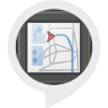

# &nbsp; [Distance Guesser](http://alexa.amazon.com/#skills/amzn1.ask.skill.87519431-49c0-4ea9-99e1-4168d3446642)
 0

To use the Distance Guesser skill, try saying...

* *Alexa, ask distance guesser to start game*

* *Alexa, ask distance guesser to begin game*

* *Alexa, ask distance guesser for help*

This is a fun simple geography game where you try to guess how far you are from a famous US city. After starting the game, Alexa will ask you to guess how far you are from a random US city. It will then tell you how close you were to see how well you know your geography! The distance information is from the Google Maps API and the location of the device is found by using the device's public IP address. All units are in miles and will only work for devices in the United States.

***

### Skill Details

* **Invocation Name:** distance guesser
* **Category:** null
* **ID:** amzn1.ask.skill.87519431-49c0-4ea9-99e1-4168d3446642
* **ASIN:** B01KAIYFL6
* **Author:** Shah
* **Release Date:** August 16, 2016 @ 07:53:33
* **In-App Purchasing:** No
