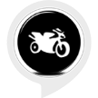

# &nbsp; [Moto Time](http://alexa.amazon.com/#skills/amzn1.ask.skill.b528485b-fe24-42a8-bba8-c94a104a6b11)
 0

To use the Moto Time skill, try saying...

* *Alexa, Open Moto Time*

* *Alexa, Start Moto Time*

* *Alexa, Begin Moto Time*

This app gives small tidbits of information and phrases about motorcycles.  Ask it for motorcycle facts and it will tell you something interesting.

***

### Skill Details

* **Invocation Name:** moto time
* **Category:** null
* **ID:** amzn1.ask.skill.b528485b-fe24-42a8-bba8-c94a104a6b11
* **ASIN:** B01KBKDTZQ
* **Author:** Freelance
* **Release Date:** August 16, 2016 @ 05:09:38
* **In-App Purchasing:** No
