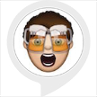

# &nbsp; [Beer Goggles](http://alexa.amazon.com/#skills/amzn1.ask.skill.3af234a4-0c61-49c6-a558-765ddf7f137a)
 4

To use the Beer Goggles skill, try saying...

* *Alexa, start Beer Goggles*

* *Alexa, play Beer Goggles*

* *Alexa, open Beer Goggles*

Using the most advanced machine learning algorithms, Alexa can help determine if you should really have another drink.  

Crack open the cool and refreshing Beer Googles skill, and Alexa will ask you a quick series of questions.  Simply respond to each question with either a "yes or no".  The sophisticated algorithms do all the thinking for you, and Beer Goggles will calculate the decision with incredible precision and accuracy.  Cheers!

Disclaimer: This skill not suitable for all ages.  Beer Goggles is recommended for adults18 years or older.  Please drink responsibility, and NEVER drink and drive.

***

### Skill Details

* **Invocation Name:** beer goggles
* **Category:** null
* **ID:** amzn1.ask.skill.3af234a4-0c61-49c6-a558-765ddf7f137a
* **ASIN:** B01KDDQG6U
* **Author:** Drew Firment
* **Release Date:** August 22, 2016 @ 07:44:40
* **In-App Purchasing:** No
