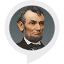

# &nbsp; [Abe Facts](http://alexa.amazon.com/#skills/amzn1.ask.skill.33f2f50a-8e5a-438e-b293-d74c87ad68e8)
 0

To use the Abe Facts skill, try saying...

* *Alexa open abe facts*

* *Alexa ask abe facts to tell me a fact*

* *Alexa ask abe facts to give me a fact*

This skill responds with facts about Abraham Lincoln

***

### Skill Details

* **Invocation Name:** abe facts
* **Category:** null
* **ID:** amzn1.ask.skill.33f2f50a-8e5a-438e-b293-d74c87ad68e8
* **ASIN:** B01KIWT9EW
* **Author:** buxur
* **Release Date:** August 22, 2016 @ 02:07:43
* **In-App Purchasing:** No
