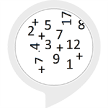

# &nbsp; [Math Flash Cards](http://alexa.amazon.com/#skills/amzn1.ask.skill.c0206e72-7411-405d-91bf-c761b6243b07)
 0

To use the Math Flash Cards skill, try saying...

* *Alexa, start math flashcards*

* *start over*

* *twelve*

A quick way to practice math. Addition, from 1 to 20, makes a fun interactive skill that just keeps your brain working better!

***

### Skill Details

* **Invocation Name:** math flashcards
* **Category:** null
* **ID:** amzn1.ask.skill.c0206e72-7411-405d-91bf-c761b6243b07
* **ASIN:** B01KJANRBO
* **Author:** Amanda Horn
* **Release Date:** August 25, 2016 @ 08:00:52
* **In-App Purchasing:** No
