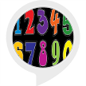

# &nbsp; [Math Subtraction Flash Cards](http://alexa.amazon.com/#skills/amzn1.ask.skill.d94afeb9-f45c-49b4-931c-2e17f3f1344c)
 0

To use the Math Subtraction Flash Cards skill, try saying...

* *Alexa start subtraction flash cards*

* *seven*

* *start over*

A flash card skill that you can use to practice memorizing subtraction to keep your mind working instead of aging!

***

### Skill Details

* **Invocation Name:** subtraction flash cards
* **Category:** null
* **ID:** amzn1.ask.skill.d94afeb9-f45c-49b4-931c-2e17f3f1344c
* **ASIN:** B01KJFKKTQ
* **Author:** Apps by Allison via PH
* **Release Date:** August 25, 2016 @ 09:00:35
* **In-App Purchasing:** No
