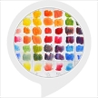

# &nbsp; [Color Mix helper](http://alexa.amazon.com/#skills/amzn1.ask.skill.eaf14c5b-472b-40ea-af58-6b31b32f57e8)
 0

To use the Color Mix helper skill, try saying...

* *Alexa, ask color helper how to make orange.*

* *Alexa, ask color helper how do I make yellow.*

* *Alexa, start color helper.*

Color theory is a vast topic, but sometimes you just want to know how to make purple!  This skill will help you with common simple colors when you can't think of how to make them!

***

### Skill Details

* **Invocation Name:** color helper
* **Category:** null
* **ID:** amzn1.ask.skill.eaf14c5b-472b-40ea-af58-6b31b32f57e8
* **ASIN:** B01KJJDQLQ
* **Author:** Apps by Allison via PH
* **Release Date:** August 22, 2016 @ 09:18:42
* **In-App Purchasing:** No
