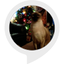

# &nbsp; [Cat Facts](http://alexa.amazon.com/#skills/amzn1.ask.skill.c9a0f8c9-228c-496d-9372-4d06d175400a)
 0

To use the Cat Facts skill, try saying...

* *Alexa ask cat facts to tell me a cat fact*

* *Alexa ask cat facts to tell me trivia*

* *Alexa ask cat facts to tell me something*

Tells you facts about cats.

***

### Skill Details

* **Invocation Name:** cat facts
* **Category:** null
* **ID:** amzn1.ask.skill.c9a0f8c9-228c-496d-9372-4d06d175400a
* **ASIN:** B01KPDFY20
* **Author:** Jogu
* **Release Date:** August 26, 2016 @ 06:02:41
* **In-App Purchasing:** No
