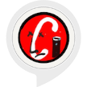

# &nbsp; [Status For Caltrain](http://alexa.amazon.com/#skills/amzn1.ask.skill.00411592-cdea-4462-816a-3952563099c0)
 0

To use the Status For Caltrain skill, try saying...

* *Alexa, ask caltrain checker for the status*

* *Give me the status*

* *What's Up*

I ride Caltrain. If you do too, you know it often runs into issues. Their updates are terrible, but a sentiment analysis of @Caltrain mentions on Twitter quickly lets you know if there has been a breakdown, accident, or worse.

Enable this skill (unaffiliated with Caltrain) to simply ask Alexa to rate the likelihood of something being really off with Caltrain. A higher score is worse. If it is over 25, you definitely need another transportation option!

Check out: https://caltraincrash.appspot.com for a text feed.

***

### Skill Details

* **Invocation Name:** caltrain checker
* **Category:** null
* **ID:** amzn1.ask.skill.00411592-cdea-4462-816a-3952563099c0
* **ASIN:** B01KSDO0W2
* **Author:** Eiger Tech LLC
* **Release Date:** August 29, 2016 @ 01:33:13
* **In-App Purchasing:** No
