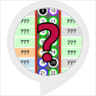

# &nbsp; [The Raspberry Pi GPIO Challenge](http://alexa.amazon.com/#skills/amzn1.ask.skill.1953c952-847d-43a4-9296-7e1433aa17e1)
 0

To use the The Raspberry Pi GPIO Challenge skill, try saying...

* *Alexa, start the GPIO Challenge*

* *Alexa, begin the GPIO Challenge*

* *Alexa, launch the GPIO Challenge*

The Raspberry Pi GPIO Challenge is a multiple choice quiz about the General Purpose In-Out (GPIO) connections on the Raspberry Pi single board computer. Can you get 5 out of 5 and prove you're a GPIO master? The quiz questions are based on the revision 2 board layout (Pi B+ onwards) and assume that the board is oriented vertically with the USB ports at the bottom.

***

### Skill Details

* **Invocation Name:** the g. p. i. o. challenge
* **Category:** null
* **ID:** amzn1.ask.skill.1953c952-847d-43a4-9296-7e1433aa17e1
* **ASIN:** B01KVPQL9M
* **Author:** Upcycled Retro Technology
* **Release Date:** August 26, 2016 @ 01:33:10
* **In-App Purchasing:** No
