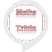

# &nbsp; [Maths Trivia](http://alexa.amazon.com/#skills/amzn1.ask.skill.f7bcf793-8da1-4f3e-8da0-b3cf47793fc5)
 0

To use the Maths Trivia skill, try saying...

* *Alexa, ask maths trivia to tell me a maths fact*

* *Alexa, ask maths trivia to give me a maths trivia*

* *Alexa, ask maths trivia to tell me a maths trivia*

Learn about some maths trivia facts.

***

### Skill Details

* **Invocation Name:** maths trivia
* **Category:** null
* **ID:** amzn1.ask.skill.f7bcf793-8da1-4f3e-8da0-b3cf47793fc5
* **ASIN:** B01KY080W0
* **Author:** atang
* **Release Date:** August 25, 2016 @ 02:03:24
* **In-App Purchasing:** No
