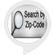

# &nbsp; [Zip Code Information](http://alexa.amazon.com/#skills/amzn1.ask.skill.c406302d-5a30-4bd3-8cf8-152b96d486de)
 0

To use the Zip Code Information skill, try saying...

* *Alexa ask zip code to tell me about nine oh two one oh*

* *Alexa tell zip code I live in one one two zero six*

* *Alexa ask zip code in what city is  oh eight five four oh*

Zip Code tells you  the city, state, and population of a US zip code.

Great if you are curious about a zip code!

Usage is simple:
Tell me about nine oh two one oh
Where is one one two zero six

Remember to fully spell out each zip code, and, unfortunately, zip code finder doesn't work with PO box, APO, or MPO zip codes.

***

### Skill Details

* **Invocation Name:** zip code
* **Category:** null
* **ID:** amzn1.ask.skill.c406302d-5a30-4bd3-8cf8-152b96d486de
* **ASIN:** B01KYA2GTI
* **Author:** Greg Bronner
* **Release Date:** August 29, 2016 @ 01:33:30
* **In-App Purchasing:** No
