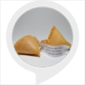

# &nbsp; [Fortune Cookie](http://alexa.amazon.com/#skills/amzn1.ask.skill.987aa5d0-9185-4026-9133-98ae37e632fa)
 0

To use the Fortune Cookie skill, try saying...

* *Alexa, launch fortune cookie*

* *Alexa, open fortune cookie and tell me a fortune*

* *Alexa, start fortune cookie*

This skill returns a random fortune cookie with words of wisdom.

***

### Skill Details

* **Invocation Name:** fortune cookie
* **Category:** null
* **ID:** amzn1.ask.skill.987aa5d0-9185-4026-9133-98ae37e632fa
* **ASIN:** B01L7MRQGK
* **Author:** Eddie King
* **Release Date:** August 30, 2016 @ 06:02:51
* **In-App Purchasing:** No
