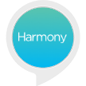

# &nbsp; [Harmony — Optimized for Smart Home](http://alexa.amazon.com/#skills/amzn1.ask.skill.c5f32b0b-92c4-473a-b0ad-3a2e83d777bd)
 394

Use Amazon Alexa with your Logitech Harmony hub-based remote to start and stop Harmony Activities. Use your voice to jump to your favorite TV station or directly into a Roku channel. For example, say "Alexa, turn on the TV" to power on your TV, AV receiver and cable box and set them all to the right inputs. You can also set up friendly names, allowing you to say "Alexa, turn on the Xbox" to trigger your Harmony Play Game Activity. This skill currently supports one Harmony hub and doesn't yet allow for adjusting volume or play/pause.

Try saying
 "Alexa, turn on the TV" 
 "Alexa, turn on Netflix" 
 "Alexa, turn on the Discovery Channel" 
 "Alexa, turn on the Xbox" 
 "Alexa, turn off my entertainment center"

Amazon Alexa works with Logitech Harmony Elite, Harmony Companion and Harmony Hub; available at logitech.com/harmony

For additional information, support or help linking your accounts together, visit myharmony.com/alexa

***

### Skill Details

* **Invocation Name:** null
* **Category:** null
* **ID:** amzn1.ask.skill.c5f32b0b-92c4-473a-b0ad-3a2e83d777bd
* **ASIN:** B01M4LDPX3
* **Author:** Logitech
* **Release Date:** October 25, 2016 @ 04:14:44
* **Privacy Policy:** https://files.myharmony.com/Assets/legal/en/privacypolicy.html
* **Terms of Use:** https://files.myharmony.com/Assets/legal/en/termsofuse.html
* **Account Linking Domains:** accounts.logi.com, accounts.google.com, graph.facebook.com, facebook.com, static.xx.fbcdn.net, m.facebook.com, www.facebook.com, fonts.gstatic.com, www.google.com, sso.logitech.com, accounts.google.co.in, accounts.google.ca, logi.my.salesforce.com, delauth.secure.force.com, na24.salesforce.com
* **In-App Purchasing:** No
